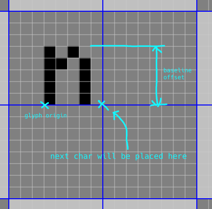

# font format

## header
includes all ascii in order, starting from first non-control character (0x20).
Each offset is stored as a u32 little endian.

| index | field                |
| ----- | -------------------- |
| 0x00  | char 0x20 offset ( ) |
| 0x04  | char 0x21 offset (!) |
| 0x08  | char 0x22 offset (#) |
| ...   |                      |

## character
| byte index | field                                               |
| ---------- | --------------------------------------------------- |
| 0          | sprite stride (bytes)                               |
| 1          | sprite h                                            |
| 2          | sprite origin offset y from baseline                |
| 3          | next character advance x from leftmost of this char |
| 4...       | sprite data (stride*h bytes)                        |

sprite data is padded to nearest 8 bits. pixels are bitpacked from left to right
in the least significant to most significant bits of the byte. NOTE this is
reversed from left/right when reading a hex/binary number.

# build_font.py
Takes a single image which is a spritesheet and converts it to the above format.

`build_font.py` only takes ascii-style (uncompressed) pbm file inputs.
imagemagick `convert input.png -compress none out.pbm` will produce the correct
format.

When invoking `buid_font.py`, specifiy in input as the first argument (`*.pbm`),
and an output as the second argument.

## input image format
Laid out in a 16x8 grid of 16px by 16px sections. Each section contains a single
letter. Sections are numbered in reading order from zero. The section's number
corresponds to the ascii value of the character within. Within a 16x16px
section, the text baseline is represented by the vertical middle point (between
7th and 8th y offset). Each character will be positioned in the font based on
it's offset from the baseline. Kerning is specified by the horizontal middle
point (between 7th and 8th pixel x offset). The next character in a laid out
string will be placed in the same position as the 8th column within a section.

## `font.png` as an example
- `convert font.png -compress none font.pbm`
- `./build_font.py font.pbm font.bin`